# 🌱 AgroTrack – AI-Powered Smart Gardening Assistant

<div align="center">

🎓 University Second Year Project – Full Stack Web Application
🌿 AI-powered gardening platform built with React, Node.js, MongoDB, Firebase & Gemini AI

</div>

## 💡 Overview

AgroTrack is a smart gardening assistant that helps users monitor, diagnose, and manage their plants with AI-powered insights.
It provides real-time plant disease detection, smart care reminders, and a community space for gardening enthusiasts — all in one integrated web platform.

## ✨ Core Features

### 🤖 AI-Powered Plant Care

**Plant Disease Detection** — Upload a photo, get instant AI diagnosis via Google Gemini API

**Smart Care Tips** — Personalized watering, fertilizing, and recovery guidance

**Plant Identification** — Recognize species and view care profiles instantly

### 🪴 Plant Management Dashboard

Maintain your own digital garden 🌿

Track watering, fertilizing, pruning, and health

Add notes, upload images, and view growth analytics

### 👥 Community & Social Space

**Forum** – Share ideas, ask questions, and vote on posts

**Expert Guidance** – Engage with verified plant experts

**User Profiles** – Personalized dashboards and garden portfolios

### 🧩 Admin Dashboard

Manage users, posts, and reports

Analyze platform-wide statistics and engagement

Moderate the community to maintain content quality

## 🏗️ Tech Stack & Architecture

| Layer | Technologies |
|-------|-------------|
| **Frontend** | React 18, TypeScript, Vite, Tailwind CSS, Shadcn/UI, Lucide Icons |
| **Backend** | Node.js, Express, TypeScript, Mongoose, JWT, Firebase Admin |
| **Database** | MongoDB Atlas |
| **AI Integration** | Google Gemini API |
| **Storage** | Firebase Storage |
| **Hosting** | Vercel / Netlify |
| **Caching** | Redis Cloud |
| **Docs** | Swagger / OpenAPI |
| **Analytics** | Recharts, TanStack Query |

## 🧠 What I Learned

� **Authentication & Role Management** using Firebase + JWT

🧠 **AI Integration** using Google Gemini for image diagnosis

☁️ **Cloud Storage & Deployment** with Firebase and Vercel

🧩 **Reusable Component Design** with Tailwind + Shadcn UI

💬 **Real-time Community System** using MongoDB and REST APIs

📊 **Data Visualization** for analytics dashboards

## 📂 Project Structure

```
AgroTrack/
├── Backend/   → Node.js + Express + MongoDB + Gemini Integration
├── Frontend/  → React + Vite + Tailwind + Shadcn/UI
├── public/    → Assets & static files
├── screenshots/ → Project screenshots
└── README.md  → Documentation (You're here!)
```

## 📸 Screenshots

### 🏠 **Home & Landing**
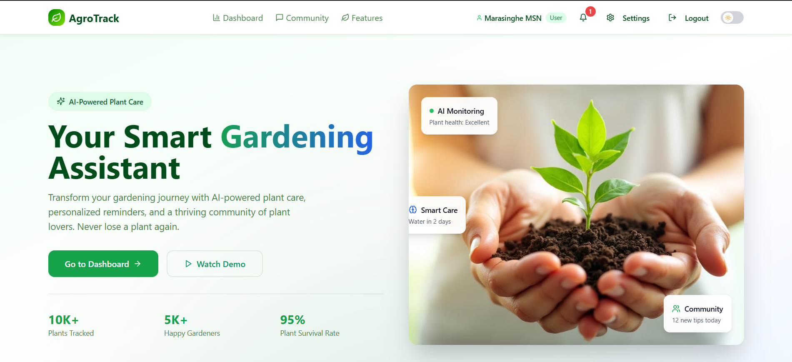
*Main landing page showcasing AgroTrack's features and navigation*

### 👤 **User Dashboard**
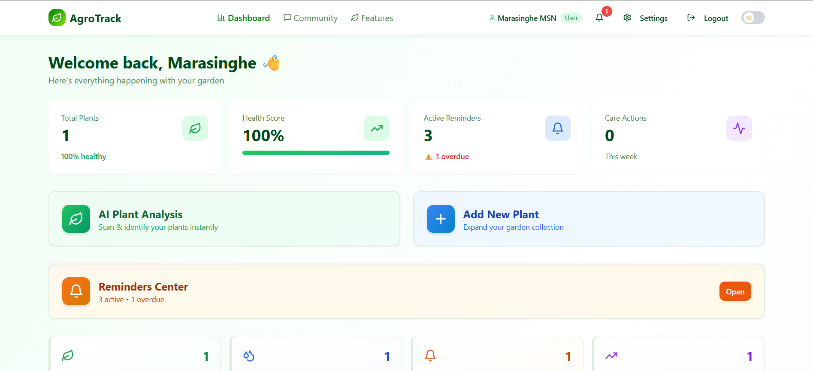
*Personalized dashboard with plant overview and quick actions*

### 🌱 **Plant Management**
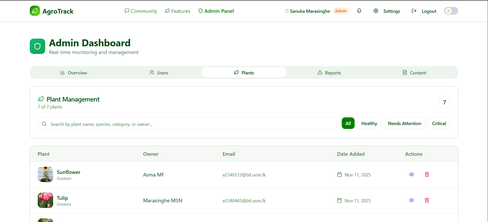
*Comprehensive plant collection management interface*

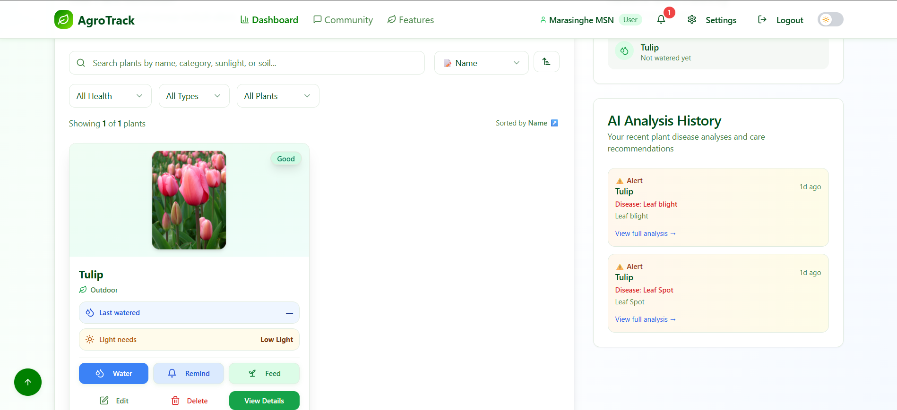
*Detailed plant information and care tracking*

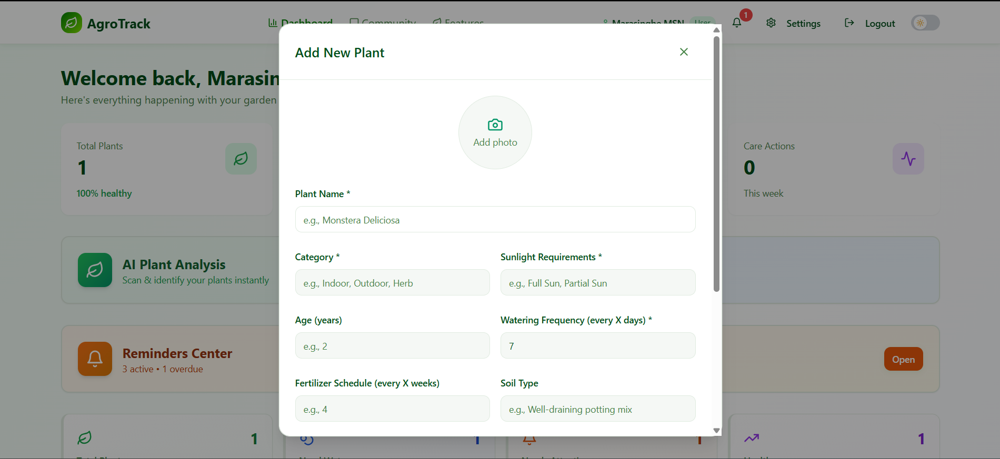
*Add new plants to your digital garden*

### 🤖 **AI Features**
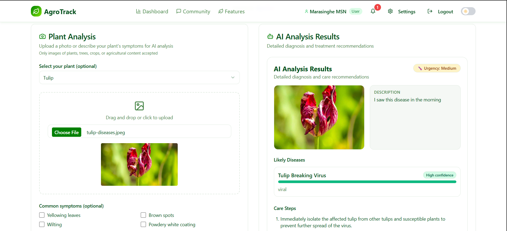
*AI-powered plant disease detection and analysis*

### 👥 **Community**
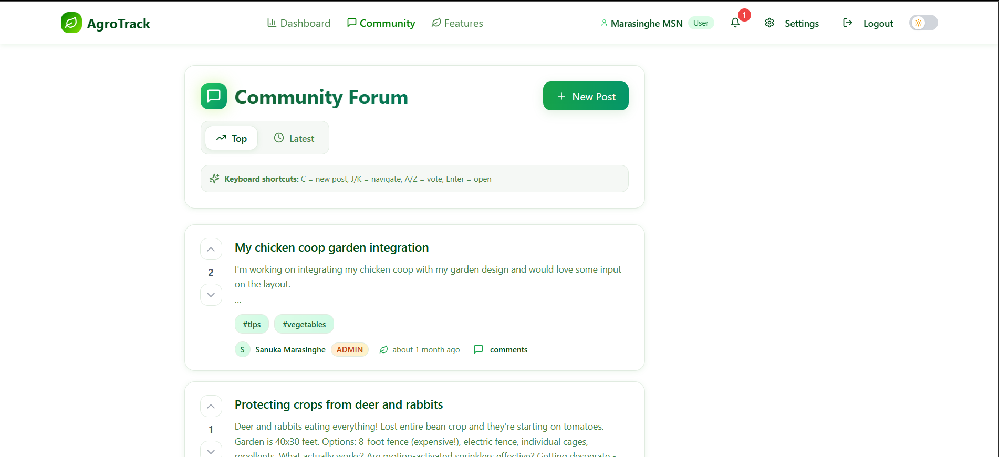
*Interactive community forum for gardening enthusiasts*

### 🔔 **Notifications & Reminders**
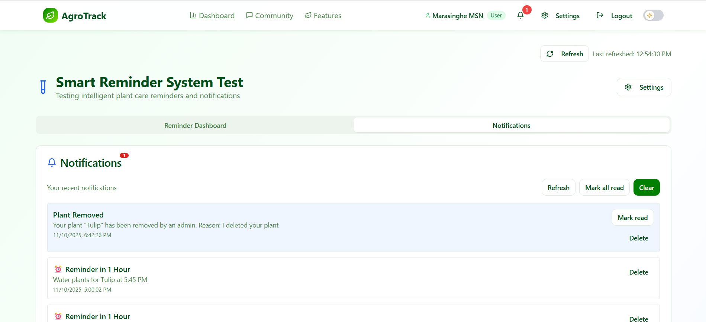
*Smart notification system for plant care*

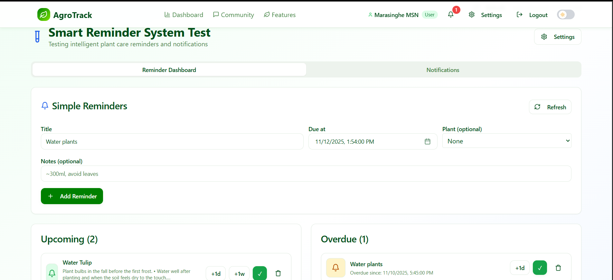
*Automated reminder system for watering and care tasks*

### 🛠️ **Admin Panel**
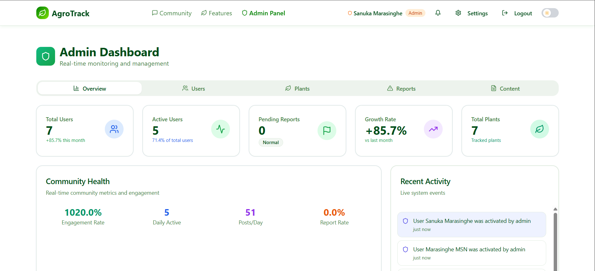
*Administrative dashboard for platform management*

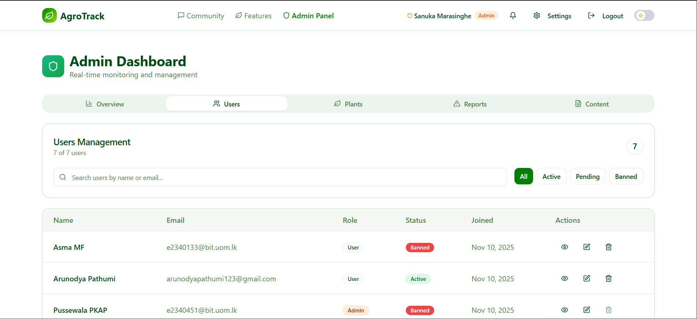
*User management and moderation tools*

### 📋 **Additional Features**
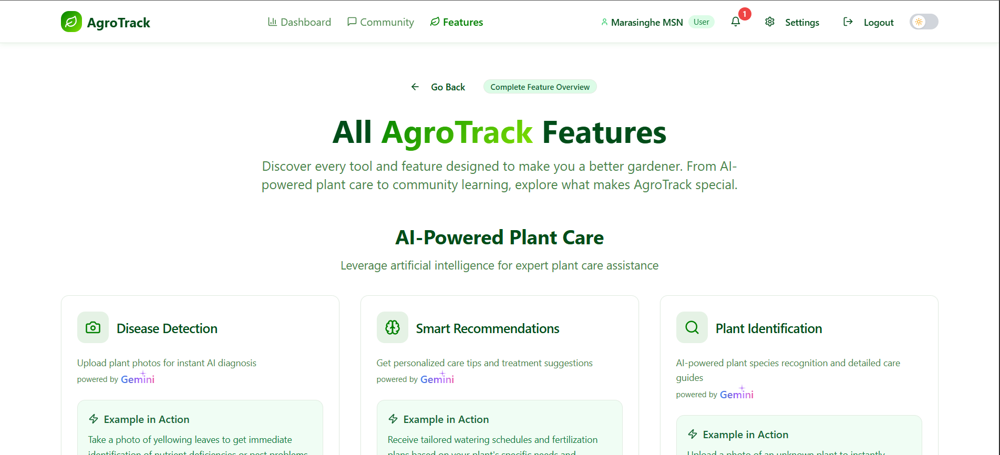
*Overview of platform features and capabilities*

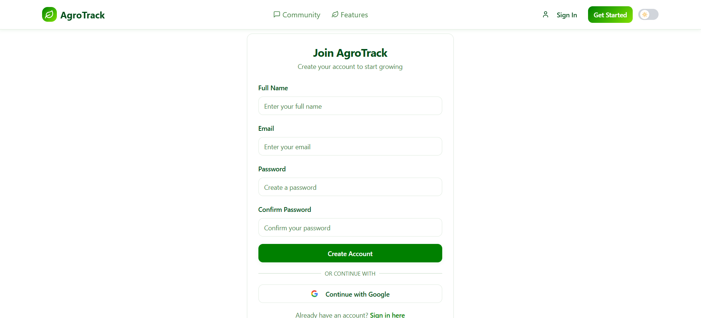
*Getting started guide for new users*

## 📘 University Information

**Project Type:** Full Stack Development Course
**Purpose:** Academic research & learning
**Scope:** AI, Cloud Integration, Database Management, and Modern Web Architecture

## 📄 License

Licensed under the MIT License — for educational and open demonstration purposes.

<div align="center">

🌿 AgroTrack – Elegant Learning for the Digital Age 🌿
AI + Gardening + Community

[⬆️ Back to Top](#-agrotrack--ai-powered-smart-gardening-assistant)

</div>
